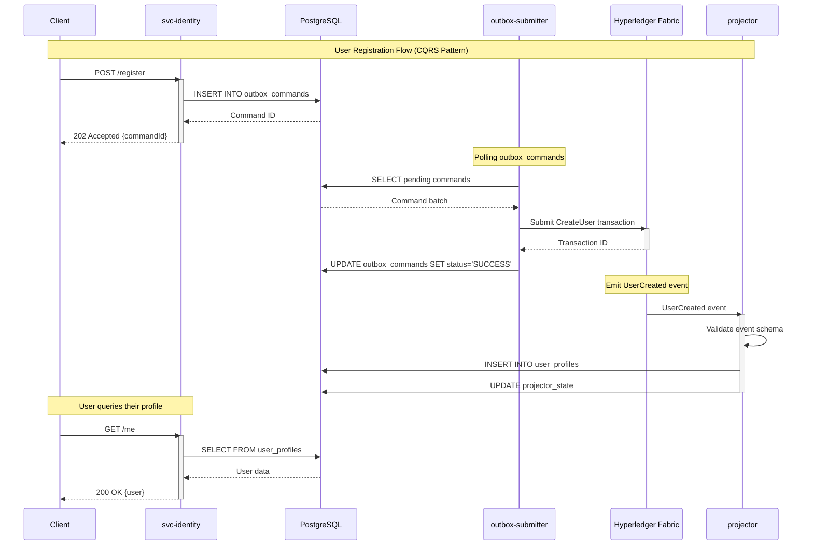

```mermaid
sequenceDiagram
    participant Client
    participant API as svc-identity
    participant DB as PostgreSQL
    participant Outbox as outbox-submitter
    participant Fabric as Hyperledger Fabric
    participant Projector as projector

    Note over Client,Projector: User Registration Flow (CQRS Pattern)

    %% Write Path (Command)
    Client->>API: POST /register
    activate API
    API->>DB: INSERT INTO outbox_commands
    DB-->>API: Command ID
    API-->>Client: 202 Accepted {commandId}
    deactivate API

    Note over Outbox: Polling outbox_commands

    Outbox->>DB: SELECT pending commands
    DB-->>Outbox: Command batch
    Outbox->>Fabric: Submit CreateUser transaction
    activate Fabric
    Fabric-->>Outbox: Transaction ID
    deactivate Fabric
    Outbox->>DB: UPDATE outbox_commands SET status='SUCCESS'

    Note over Fabric: Emit UserCreated event

    %% Read Path (Query)
    Fabric->>Projector: UserCreated event
    activate Projector
    Projector->>Projector: Validate event schema
    Projector->>DB: INSERT INTO user_profiles
    Projector->>DB: UPDATE projector_state
    deactivate Projector

    Note over Client,API: User queries their profile

    Client->>API: GET /me
    activate API
    API->>DB: SELECT FROM user_profiles
    DB-->>API: User data
    API-->>Client: 200 OK {user}
    deactivate API
```
